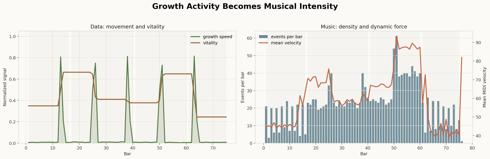
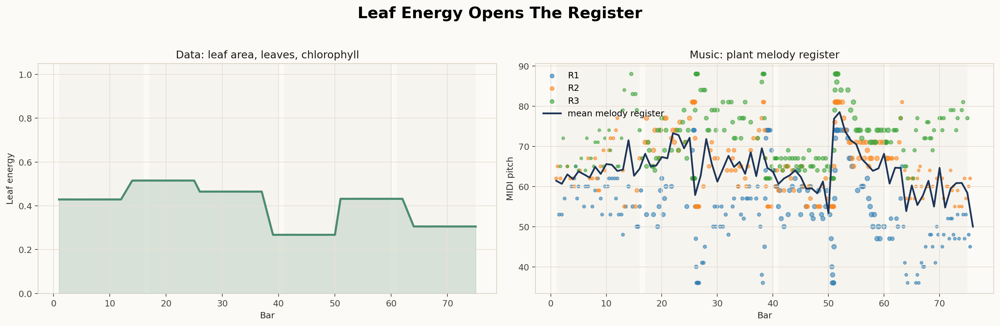
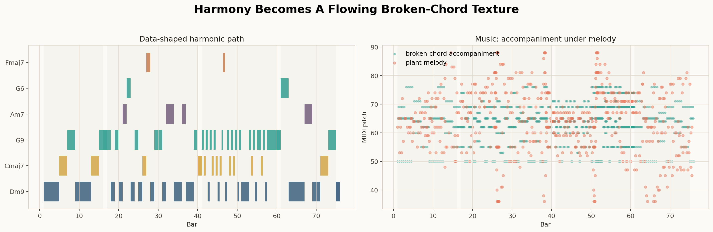

# Plant Growth Music

This repository turns greenhouse plant growth measurements into a short musical work.

The plants do not simply become notes. Their growth becomes pressure, motion, brightness, density, and release. Three plant batches sing as three melodic stems; a quiet broken-chord accompaniment gives them harmonic ground; the piece closes on a final `D3`, as if the data exhales.

[Download the generated WAV demo](outputs/audio/plant_music_demo.wav)

## What To Open First

```text
outputs/audio/plant_music_demo.wav
outputs/midi/plant_music_full.mid
outputs/figures/growth_to_intensity.png
outputs/figures/leaf_to_register.png
outputs/figures/harmony_to_accompaniment.png
```

The isolated MIDI stems are also exported:

```text
outputs/midi/R1_stem.mid
outputs/midi/R2_stem.mid
outputs/midi/R3_stem.mid
outputs/midi/ACCOMP_stem.mid
```

## Source

The piece is generated from the Kaggle dataset [Greenhouse Plant Growth Metrics](https://www.kaggle.com/datasets/adilshamim8/greenhouse-plant-growth-metrics):

```text
data/Greenhouse Plant Growth Metrics.csv
```

For a short dataset summary and exploratory notebook, see:

```text
data/greenhouse_plant_growth_eda.ipynb
```

The dataset has `30,000` rows and three plant batches: `R1`, `R2`, and `R3`.

## The Translation

The row sequence becomes time. Every `100` rows becomes one beat.

| Setting | Value |
|---|---:|
| Tempo | `90 BPM` |
| Meter | `4/4` |
| Data timeline | `200 seconds` |
| Rendered duration | `202.7 seconds` |
| Mode | `D Dorian` |

The three plant batches become melodic voices:

| Batch | Instrument | Role |
|---|---|---|
| `R1` | Marimba | Lower/mid plant melody |
| `R2` | Harp | Mid-register plant melody |
| `R3` | Celesta | Upper plant melody |
| `ACCOMP` | Piano | Flowing broken-chord background |

The raw plant measurements are blended into musical control signals:

| Plant Signal | Musical Meaning |
|---|---|
| `growth_mass` | Phrase body, duration, melodic weight |
| `leaf_energy` | Register and openness |
| `root_energy` | Tension and leap pressure |
| `vitality` | Dynamics |
| `growth_speed` | Rhythmic activity |

## Why It Sounds Musical

Directly mapping growth to pitch would create a staircase. Plants mostly grow upward; melodies need to breathe.

Instead, the generator uses plant data to shape a melodic contour: when the line moves, how far it moves, how strongly it leaps, and how much force it carries. The melody is then placed inside a shared `D Dorian` harmonic path using chords such as `Dm9`, `G9`, `Cmaj7`, `Fmaj7`, and `Am7`.

Under the plant melodies is a continuous accompaniment:

```text
low chord tone -> middle chord tone -> high chord tone -> middle chord tone
```

When a chord repeats, the pattern shifts slightly. At bloom/climax moments, the accompaniment becomes faster and stronger. The result is not a graph wearing musical clothes; it is a musical texture grown from the graph.

## Shape Of The Piece

| Section | Bars | Character |
|---|---:|---|
| Germination | `1-16` | Sparse, quiet, tentative |
| Growth | `17-40` | More motion, more direction |
| Bloom | `41-60` | Dense, bright, climactic |
| Settling | `61-75` | Thinning, returning, resolving |

The final note is a sustained `D3`, the tonic of the scale.

## Showcase Figures

The visualizations are paired: plant behavior on one side, musical consequence on the other.

### Growth To Intensity



`growth_speed` and `vitality` become musical density and dynamic force. This is where the biological pulse becomes audible activity.

### Leaf Energy To Register



Leaf-related energy pushes the melody toward a more open register. The figure shows the data curve beside the pitch field it helps shape.

### Harmony To Accompaniment



The harmonic plan becomes the continuous broken-chord background. The left panel shows the chord path; the right panel shows the accompaniment moving underneath the plant melodies.

## Current Output Snapshot

| Metric | Value |
|---|---:|
| Rendered duration | `202.7s` |
| Plant melody events | `606` |
| Accompaniment events | `1128` |
| Final resolution events | `1` |
| Melody chord-tone fit | `98.8%` |
| Bloom density | `34.5 events/bar` |

## Run It

Install Python dependencies from `environment.yml` or use an environment with `pandas`, `numpy`, `pyyaml`, and `matplotlib`.

For best audio rendering, install FluidSynth and a GM-compatible SoundFont. On Ubuntu/Debian:

```bash
sudo apt install fluidsynth fluid-soundfont-gm
```

If FluidSynth or the SoundFont is unavailable, the pipeline still writes MIDI and renders a simple fallback WAV.

Generate everything:

```bash
python scripts/run_all.py --config config/default.yml
```

Regenerate only the audio:

```bash
python scripts/render_demo.py --config config/default.yml
```

Regenerate only the figures:

```bash
python scripts/make_visualizations.py --config config/default.yml
```

## Documentation

For the musical mapping and aesthetic decisions, read:

```text
design_notes.md
```

For implementation details, read:

```text
implement_notes.md
```

The main configuration lives in:

```text
config/default.yml
```
