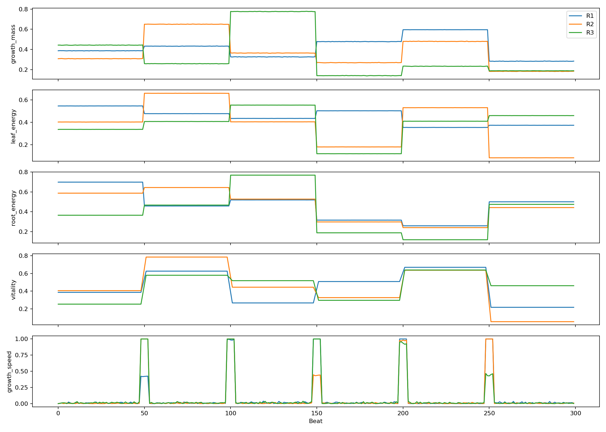
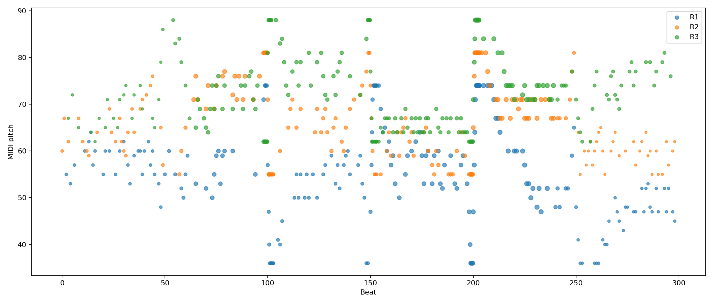
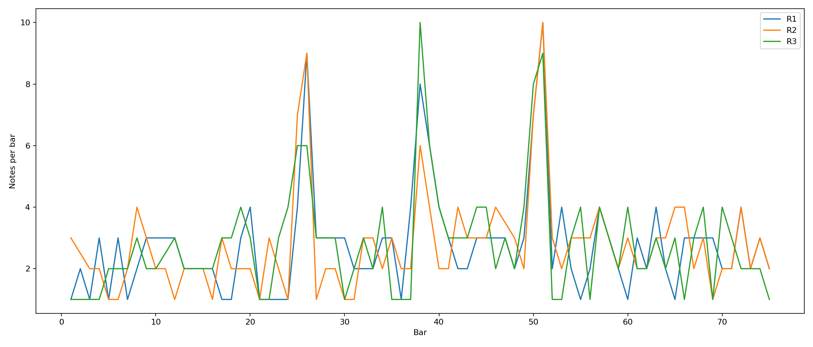
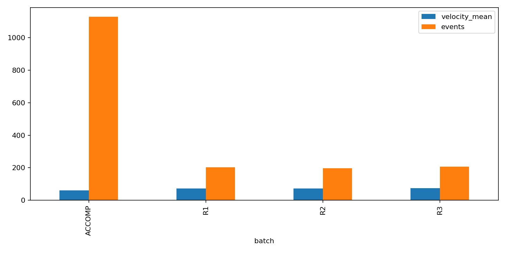

# Plant Growth Music

Plant Growth Music is a data-sonification project that turns greenhouse plant growth measurements into a 3-minute musical piece. The piece uses three musical stems, one for each plant batch, and maps growth patterns into pitch, rhythm, dynamics, register, and form.

The data provides the structure for the composition. Changes in plant growth become changes in melody, timing, intensity, and texture, creating a piece that follows the development of the plants over time.

## Listen

Generated demo audio:

[Download to the generated WAV demo](outputs/audio/plant_music_demo.wav)

The full MIDI arrangement is here:

```text
outputs/midi/plant_music_full.mid
```

Isolated stems are also available:

```text
outputs/midi/R1_stem.mid
outputs/midi/R2_stem.mid
outputs/midi/R3_stem.mid
```

## Data Source

The piece is generated from:

```text
data/Greenhouse Plant Growth Metrics.csv
```

This [Kaggle](https://www.kaggle.com/datasets/adilshamim8/greenhouse-plant-growth-metrics) dataset contains `30,000` rows of plant growth measurements across three batches:

| Batch | Musical Stem |
|---|---|
| `R1` | Marimba stem |
| `R2` | Harp stem |
| `R3` | Celesta stem |

The row sequence is treated as musical time. Every `100` rows becomes one beat.

Current musical timeline:

| Setting | Value |
|---|---:|
| Tempo | `90 BPM` |
| Meter | `4/4` |
| Length | `75 bars` |
| Duration | `200 seconds` |
| Scale | `D Dorian` |

For a brief dataset summary and exploratory analysis, see [data/greenhouse_plant_growth_eda.ipynb](data/greenhouse_plant_growth_eda.ipynb).

## Mapping Design

Plant growth is often gradual or monotonic. If growth were mapped directly to pitch, the result would be a predictable rising line. Instead, this project uses a contour-based mapping: plant data influences how the melody moves rather than simply deciding absolute pitch height.

### Derived Signals

The raw features are combined into musical control signals:

| Plant Signal | Data Meaning | Musical Meaning |
|---|---|---|
| `growth_mass` | Vegetative/root mass | Note duration, melodic direction, body |
| `leaf_energy` | Leaf area, leaf count, chlorophyll | Register and openness |
| `root_energy` | Root length, diameter, root dry matter | Tension and leap probability |
| `vitality` | Growth rate, chlorophyll, leaf area | Dynamics and intensity |
| `growth_speed` | Local change in growth mass | Rhythm density and melodic motion |

### Pitch

Pitch is generated with a melodic contour walker in `D Dorian`.

The walker responds to the plant data like this:

| Data Behavior | Pitch Behavior |
|---|---|
| Higher `leaf_energy` | Higher register tendency |
| Higher `growth_speed` | Larger melodic motion |
| Higher `root_energy` | Greater tension and leap probability |
| Rising local `growth_mass` | Upward melodic bias |
| Falling local `growth_mass` | Downward melodic bias |

The current version intentionally allows occasional dramatic leaps when both motion and tension are high. This makes the music less static while keeping the leaps connected to data events.

### Rhythm

Rhythm is driven mainly by `growth_speed`.

When plant activity is subtle, the music is sparser. When local growth change spikes, the music becomes denser and more animated. A contrast curve is applied so small and medium growth changes remain audible instead of disappearing.

### Dynamics

Dynamics are mapped from `vitality`.

The current MIDI velocity range is wide, from quiet `35` to strong `118`, so the piece has a clear expressive arc rather than a flat dynamic profile.

### Form

The data drives local details, but the overall piece is shaped into a growth narrative:

| Section | Bars | Musical Character |
|---|---:|---|
| Germination | `1-16` | Quiet, sparse, tentative |
| Growth | `17-40` | More active and directional |
| Bloom | `41-60` | Densest, loudest, most dramatic |
| Settling | `61-75` | Thinning texture and lower intensity |

This formal layer makes the piece easier to hear as music while still preserving plant-data influence inside each section.

## Result Interpretation

The resulting piece should sound like a gradual biological process becoming musical: sparse early gestures, increased activity through the growth section, a louder and denser bloom, then a settling phase.

The three stems represent different plant batches rather than traditional melody/accompaniment roles:

| Stem | Interpretation |
|---|---|
| `R1` marimba | Grounded body of growth, now with a wider low register |
| `R2` harp | Mid-register connective motion |
| `R3` celesta | Bright upper details and active growth points |

The current metrics show the intended musical arc:

| Metric | Result |
|---|---:|
| Duration | `200.0 seconds` |
| `R1` events | `203` |
| `R2` events | `197` |
| `R3` events | `206` |
| Germination mean velocity | `49.47` |
| Growth mean velocity | `76.53` |
| Bloom mean velocity | `96.32` |
| Settling mean velocity | `49.03` |
| Bloom density | `9.7 notes/bar` |

The bloom section is therefore both louder and denser than the surrounding sections, which matches the intended growth narrative.

## Representative Figures

### Growth Signals



This figure shows the plant-derived control signals over musical time. It is useful for seeing how the biological measurements become compositional control curves.

Important interpretation:

- `growth_speed` contains spikes rather than a smooth continuous rise.
- `vitality`, `growth_mass`, and `leaf_energy` move more gradually.
- This explains why the mapping uses contrast enhancement and form multipliers: the raw signals are meaningful, but they need musical shaping to produce a dramatic piece.

### Piano Roll



This figure shows the generated notes over time.

Important interpretation:

- Each batch occupies a related but distinct register.
- The pitch lines move both upward and downward rather than simply rising.
- Wider leaps appear in moments of higher activity/tension.
- The bloom section has the strongest visual concentration of events.

### Velocity And Density



This figure helps evaluate whether the music gets more active when the plant-derived signals indicate more activity.

Important interpretation:

- Germination is intentionally restrained.
- Bloom becomes the most active musical region.
- Settling reduces intensity after the bloom.

### Stem Comparison



This figure compares the three plant batches as musical stems.

Important interpretation:

- The stems are not identical copies of one mapping.
- They share the same scale and formal structure, but each batch produces different pitch ranges, densities, and velocity profiles.

## Run The Project

For best audio rendering, install FluidSynth and use a GM-compatible SoundFont. On Ubuntu/Debian, this is typically:

```bash
sudo apt install fluidsynth fluid-soundfont-gm
```

If FluidSynth or the configured SoundFont is unavailable, the project still runs and renders a simple fallback WAV demo from the generated MIDI events.

Generate MIDI, audio, figures, event logs, and metrics:

```bash
python scripts/run_all.py --config config/default.yml
```

Only regenerate audio from the current MIDI/events:

```bash
python scripts/render_demo.py --config config/default.yml
```

Only regenerate figures from the current outputs:

```bash
python scripts/make_visualizations.py --config config/default.yml
```

## Configuration

Mapping choices are configurable in:

```text
config/default.yml
```

Useful settings to experiment with:

- `scale.root`
- `scale.mode`
- stem registers
- velocity range
- form multipliers
- pitch leap threshold/probability
- rhythm density curve
- FluidSynth render gain

After changing configuration, rerun:

```bash
python scripts/run_all.py --config config/default.yml
```
